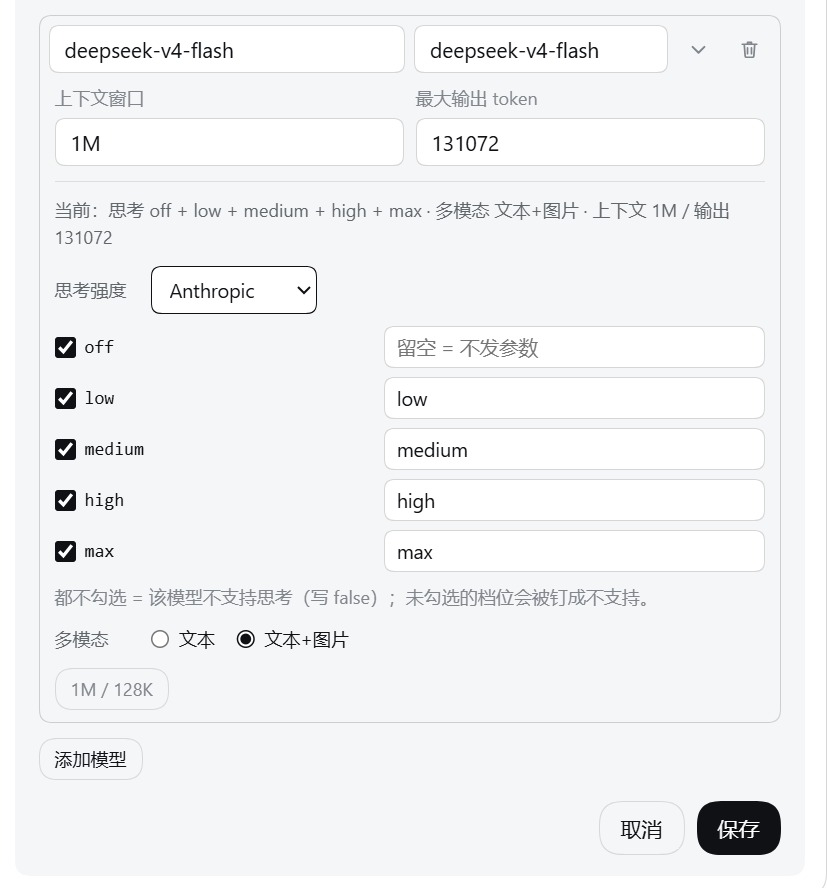
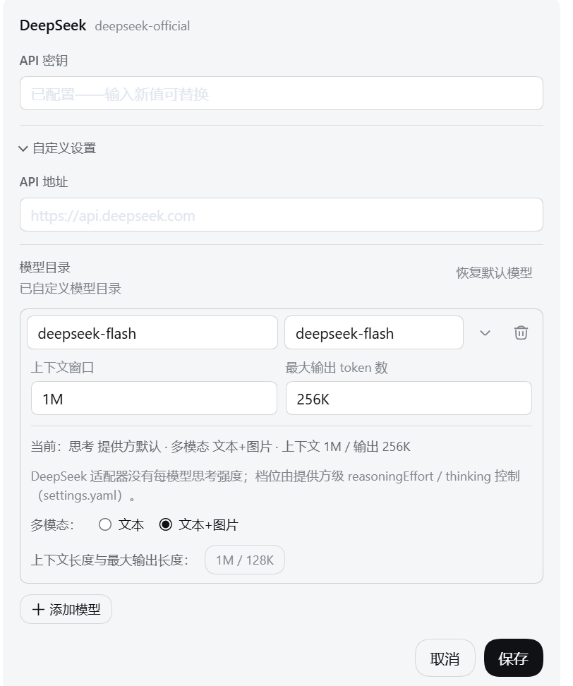
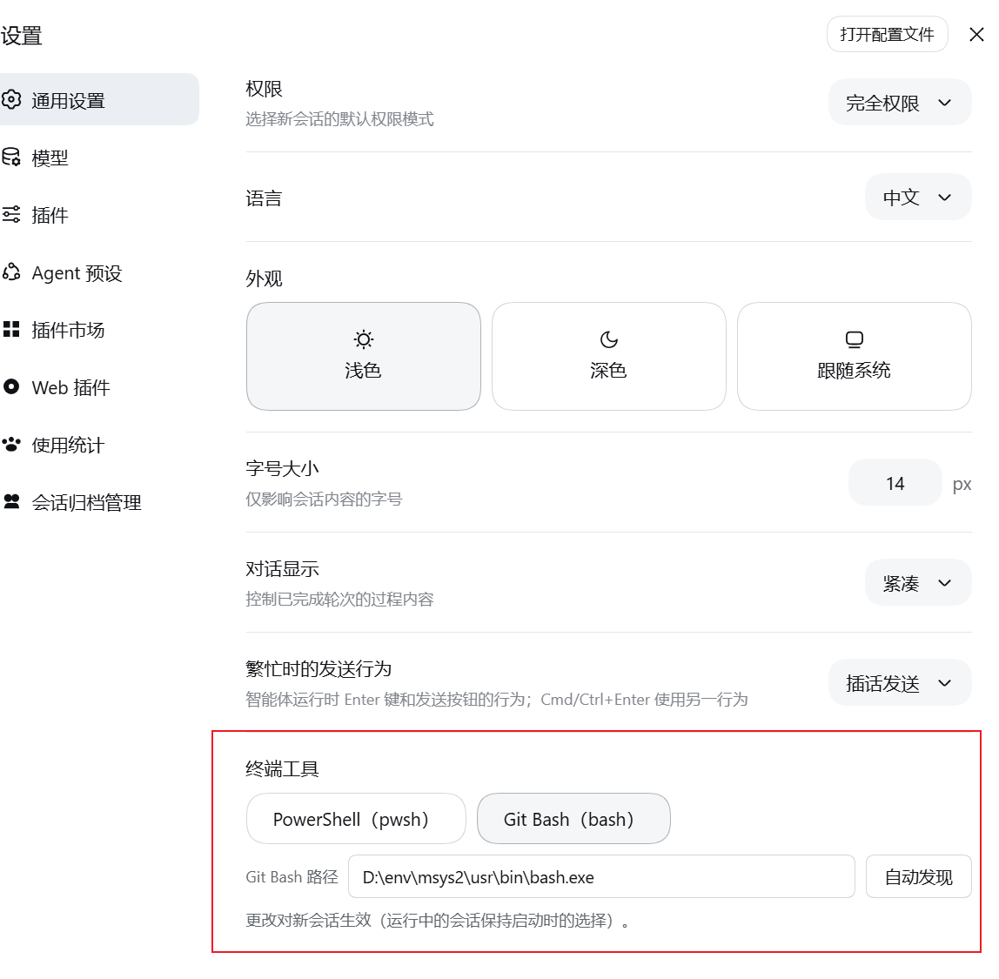

# dsh-tweaks

给 **DSH（DeepSeek Harness）** 装的一套小插件：装上就直接用，不用改 DSH 本身。

> 适配 DSH **0.1.5-rc.1**。

---

## 目录

- [prompt-history —— 输入框里的历史提示词](#prompt-history--输入框里的历史提示词)
- [model-capabilities —— 给模型行补上「思考强度 / 多模态 / 容量」](#model-capabilities--给模型行补上思考强度--多模态--容量)
- [turn-file-revert —— 本轮改动统计 + 一键撤回](#turn-file-revert--本轮改动统计--一键撤回)
- [git-bash-terminal-tool —— 可将 Windows 环境下的终端工具替换为 Git Bash](#git-bash-terminal-tool--可将-windows-环境下的终端工具替换为-git-bash)
- [安装](#安装)

---

## prompt-history —— 输入框里的历史提示词

**它能做什么**

在会话输入框里按 ↑ / ↓，翻出这个会话里之前发过的提示词，像终端里翻命令历史一样。翻到想要的，改一改就能直接发。

**怎么用**

1. 点进输入框，确保里面是空的。
2. 按 **↑**：自动填上你上一次发过的提示词；再按 **↑** 继续往更早翻。
3. 按 **↓** 往回翻；翻过最新一条时，输入框恢复成你按 ↑ 之前的内容。
4. 翻到想要的 → 直接编辑，或者回车发送。

翻的过程中，输入框右上角会显示 `↑↓ 历史 3/12`，告诉你现在翻到第几条：


> 只有输入框为空时才会接管 ↑，不会跟 `/` 命令菜单、`@` 引用菜单打架；历史只属于当前会话，刷新页面也还在。

---

## model-capabilities —— 给模型行补上「思考强度 / 多模态 / 容量」

**它能做什么**

在 DSH 里编辑模型时，官方界面没有"这个模型支不支持思考""支不支持图片"这类开关。这个插件把这些开关补进模型行，并给容量加两个快捷键：

- **思考强度** —— 先用「协议预置」选协议，它决定可选档位：`OpenAI` = off / minimal / low / medium / high / xhigh / max，`Anthropic` = off / low / medium / high / xhigh / max。两个预置默认都勾 off / low / high / max；一个都不勾 = 这个模型不支持思考。
- **多模态** —— 选「文本」或「文本+图片」。
- **容量快捷填入** —— 「上下文窗口 / 最大输出」各有一个 `1M` / `128K` 按钮；新建模型行展开容量时会自动填好 1000000 / 131072。

**怎么用**

1. 打开 **设置 → 模型**，选一个提供方（比如 `llm-pi-ai`）→ **编辑** → **自定义设置**。
2. 找到要改的模型那一行，点 **「容量」** 展开。
3. 展开后顶部会显示这个模型当前的配置摘要，下面就是思考强度、多模态和容量按钮。思考强度先用 **「协议预置」** 选 `OpenAI` / `Anthropic`，档位行会换成该协议的枚举（默认勾 off / low / high / max）。
4. 勾好、选好之后，点官方那个 **「保存」** 就写进去了。

**第三方网关（`llm-pi-ai`）** —— 思考强度 + 多模态 + 容量快捷填入：



**官方 DeepSeek（`llm-deepseek`）** —— 只有多模态（DeepSeek 的思考档位是提供方级设置，这里只读显示）：



---

## turn-file-revert —— 本轮改动统计 + 一键撤回

**它能做什么**

每轮对话结束，这个插件在回合末尾补一行：

- 这一轮总共 **加了多少行、删了多少行**，改了 **几个文件**；
- 一个 **「撤回全部修改」** 按钮：一次把这一轮改过的文件全部还原到改动前；
- 撤回之后按钮会变成 **「重新应用修改」**，再点一下就原样写回去。

补出来的一行长这样：

    本轮改动情况：+52 行 −7 行    3 个文件    [撤回全部修改]

**怎么用**

1. 等一轮"改过文件"的对话结束。
2. 在回合末尾找到插件补的那一行。
3. 点 **「撤回全部修改」** → 文件回到这一轮开始前的内容，按钮变成「重新应用修改」。
4. 想反悔，就再点 **「重新应用修改」**。

> 这一行**不依赖官方的「本轮文件改动」行**：模型在 `run_code` 里改文件时官方不会列，插件照样统计。
> **只有本会话最后一次对话能撤回 / 重新应用**：更早回合的按钮是灰的，鼠标移上去提示「该轮对话改动现在不支持撤回/恢复」。

**① 本轮有改动 —— 统计 + 可点的「撤回全部修改」**


**② 点了「撤回全部修改」—— 按钮变成「重新应用修改」**


**③ 更早的回合 —— 按钮置灰，鼠标移上去给提示**


---

## git-bash-terminal-tool —— 可将 Windows 环境下的终端工具替换为 Git Bash

**它能做什么**

Windows 上 DSH 默认让模型用 PowerShell（工具名 `pwsh`）执行命令。这个插件把它换成 **Git Bash**，
并且**对所有 preset 生效**（standard / ptc / cordis / minimal）——不改 DSH 源码，也不改任何 preset 文件。

- 模型看到的工具叫 `bash`，描述是 Git Bash 方言（POSIX 路径、`$VAR`）；`pwsh` 从工具目录里消失；
- system prompt 里的 PowerShell 段被压掉，换成 bash 那段；
- 终端卡片、退出码 pill、后台任务、沙箱拒绝与升级，表现与官方一致。

**怎么用**

1. 打开 **设置 → 通用 → 终端工具**（插件只在 Windows 上挂载，其他平台这一行根本不存在）。
   默认是 **PowerShell（pwsh）**，这里只有两个工具选项 —— 插件**不会自动替你选**。
2. 点 **Git Bash（bash）**：这时才出现「Git Bash 路径」与 **自动发现** 按钮（切回 pwsh 就又收起来）。
3. 点 **自动发现**：扫描 Git for Windows / MSYS2 / Cygwin，把**第一个可用** `bash.exe` 填进路径栏并记住它；
   找到多条 git 路径时，路径栏会变成**下拉列表**，重启 DSH 后依然可选。
4. **开一个新会话**即生效。



> 不用 WSL 的 `bash`：`System32` 与 `WindowsApps` 下的 `bash.exe` 会被硬排除。
> 只有**极简模式（minimal）**受影响：它原本是持久 shell，会被换成一次性 Git Bash（PTY 后端在 Windows 上走不通）。
> 其他三个官方预设（standard / ptc / cordis）本来就是一次性 shell，不受影响。

详细说明（含排障与已知限制）见 [`plugins/git-bash-terminal-tool/README.md`](./plugins/git-bash-terminal-tool/README.md)。

---

## 安装

下载本仓库，然后安装需要的插件。各插件互相独立，下方以 **prompt-history** 为例，把名称换成
对应插件所在目录名（如 `model-capabilities`、`turn-file-revert`、`git-bash-terminal-tool`）即可：

```
npx @deepseek-ai/dsh plugin --profile web add "<仓库目录>/plugins/prompt-history"
```

安装完成后重启 DSH，并在浏览器中强制刷新（`Ctrl + Shift + R`）。

> `<仓库目录>` 指你把本仓库下载（克隆）到的目录；`web` 为 DSH 的 profile 名称，其配置在 DSH 主目录下的 `profiles/` 里：默认即用户目录下的 `~/.dsh`（Windows 为 `%USERPROFILE%\.dsh`），若设置了 `DSH_HOME` 则以其为准。
