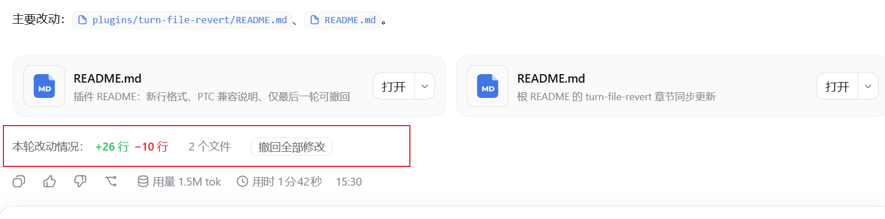
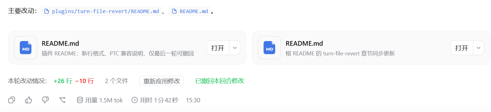
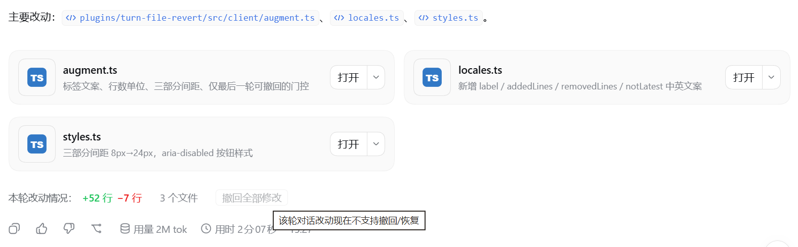

# dsh-tweaks-turn-file-revert

每轮对话改完文件后，在回合末尾多给一行统计，并提供「一键撤回 / 重新应用」。

## 它能做什么

- 这一轮总共 **加了多少行、删了多少行**，改了 **几个文件**；
- 一个 **「撤回全部修改」** 按钮：把这一轮改过的文件一次性还原成改动前的内容；
- 撤回之后按钮会变成 **「重新应用修改」**，再点一下就把改动原样写回去——反悔了不用重新让模型改一遍。

补出来的一行长这样：

    本轮改动情况：+52 行 −7 行    3 个文件    [撤回全部修改]

> 只要这一轮有文件改动就会出现，**不要求官方那行「本轮文件改动」也在**：模型在 `run_code` 里改文件时官方不会列，本插件照样统计。

## 怎么用

1. 等一轮"改过文件"的对话结束。
2. 在回合末尾找到插件补的那一行。
3. 点 **「撤回全部修改」** → 文件回到这一轮开始前的内容，按钮变成「重新应用修改」，并提示「已撤回本回合修改」。
4. 想反悔，就再点 **「重新应用修改」**。

> **只有本会话最后一次对话能撤回 / 重新应用。** 更早回合的按钮是灰的，鼠标移上去提示「该轮对话改动现在不支持撤回/恢复」，点了也不会执行——免得把后面几轮已经改好的结果覆盖回去。发出新一轮对话后，上一轮的按钮会自动变灰。

**① 本轮有改动 —— 统计 + 可点的「撤回全部修改」**



**② 点了「撤回全部修改」—— 按钮变成「重新应用修改」**



**③ 更早的回合 —— 按钮置灰，鼠标移上去给提示**



## 说明

- 只统计 / 撤回**模型通过文件工具改的内容**（`write` / `edit` / `str_replace_editor`，新建、修改都算）——直接调的、在 `run_code` 里调的都算；你自己在终端或编辑器里改的文件不在这一行里。
- 撤回是**整轮一起撤**，不能只撤其中某个文件。
- 撤回以插件记录的**「改动前内容」**为准直接写回；磁盘上如果已经和记录不一致（比如你手动改过），它**仍然会覆盖**，并在结果里标出「覆盖了 N 个已被改动的文件」。
- 鼠标停在那一行上，可以看到这一轮每个文件的 +/− 明细。
- **重启 DSH 之后**，之前回合的记录会丢：那些回合不会再显示这一行，也撤不了。
- 只读模式（read-only 沙箱）下拒绝写回，也不会删除本回合新建的文件。

## 安装

```powershell
npx @deepseek-ai/dsh plugin --profile web add "D:\你的目录\dsh-tweaks\plugins\turn-file-revert"
```

重启 DSH，并在浏览器中强制刷新（`Ctrl + Shift + R`）。

> 本插件含宿主半区，必须重启 DSH 后生效。
> `web` 为 DSH 的 profile 名称，可在 `C:\Users\你的用户名\.dsh\profiles\` 下确认。

## 开发者

本仓库的开发约定、DSH 契约与通用坑见 [AGENTS.md](../../AGENTS.md)。
