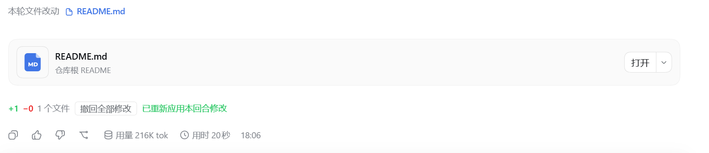

# dsh-tweaks-turn-file-revert

每轮对话改完文件后，在官方「本轮文件改动」下面多给一行统计，并提供「一键撤回 / 重新应用」。

## 它能做什么

- 这一轮总共 **加了多少行、删了多少行**，改了 **几个文件**；
- 一个 **「撤回全部修改」** 按钮：把这一轮改过的文件一次性还原成改动前的内容；
- 撤回之后按钮会变成 **「重新应用修改」**，再点一下就把改动原样写回去——反悔了不用重新让模型改一遍。

## 怎么用

1. 等一轮"改过文件"的对话结束。
2. 在官方「本轮文件改动」那一行的**下面**，找到插件补的那行：`+42 −7 · 3 个文件 · [撤回全部修改]`。
3. 点 **「撤回全部修改」** → 文件回到这一轮开始前的内容，按钮变成「重新应用修改」，并提示「已撤回本回合修改」。
4. 想反悔，就再点 **「重新应用修改」**。

**① 本轮有改动 —— 统计 + 「撤回全部修改」**


**② 点了「撤回全部修改」—— 按钮变成「重新应用修改」**


**③ 再点「重新应用修改」—— 改动原样写回**



## 说明

- 只统计 / 撤回**模型通过文件工具改的内容**（新建、修改都算）；你自己在终端里改的文件不在这一行里。
- 撤回是**整轮一起撤**，不能只撤其中某个文件。
- 若文件已经又被改过（后来的回合，或你手动改的），撤回**不会**覆盖它，会在结果里标出来。
- **重启 DSH 之后**，之前回合的记录会丢，只有当前进程里追踪到的回合能撤。
- 只读模式下拒绝删除文件。

## 安装

```powershell
npx @deepseek-ai/dsh plugin --profile web add "D:\你的目录\dsh-tweaks\plugins\turn-file-revert"
```

重启 DSH，并在浏览器中强制刷新（`Ctrl + Shift + R`）。

> 本插件含宿主半区，必须重启 DSH 后生效。
> `web` 为 DSH 的 profile 名称，可在 `C:\Users\你的用户名\.dsh\profiles\` 下确认。

## 开发者

本仓库的开发约定、DSH 契约与通用坑见 [AGENTS.md](../../AGENTS.md)。
